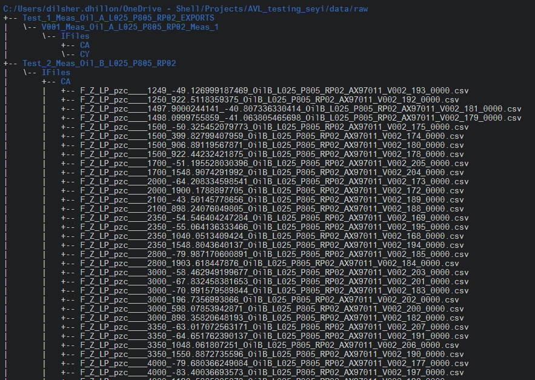

```{r setup, include=FALSE}
knitr::opts_chunk$set(echo = TRUE)
```


```{r libraries, warning=FALSE, message=FALSE}
library(tidyverse)
library(here)
library(fs)
```

## Introduction   

This document describes the process of merging and extracting engine test data for several parameters.   Two oils, A and B, are compared at different engine speeds and loads to measure the parameter of interest, force generated.   But before we start analyzing the data, there are several other parameters of interest that need to be explored. 

**Data structure**  

Each parameter has 40 files associated with it, and these 40 files represent each combination of load and speed set for the experiment.  There are 8 parameters of interest.   The naming conventions and the file structures look like 


) 

The first number after the parameter `F_Z_LP_PZC` , represented the speed that was set for that particular run, and within each file, there is a variable `SPEED`, which is what was *measured*.  Similarly, the number after the speed, is the load that was set for the experiment, and each file contains a variable `IMEP1`, that indicates what was the *measured* load.   

So the 4 meta-variables that I needed to extract were the parameter of interest, speed, load and the type of oil. And this needed to be appended to the data contained in each file.   

In addition , tests 1 and 2 were run by a different project manager than tests 3-6, and therefore, the naming conventions were slightly different.  So the rules I set to extract from Test 1 and Test 2 (which came in earlier), didn't end up working for test 3-6.   We'll refer to these as Batch 1 and Batch 2 naming conventions.   


**Example of a Batch 1 and 2 file**  

Batch 1 
`F_Z_LP_pzc____800_-33.743652133942_OilA_L025_P805_RP02_AX97011_V001_79_0000.csv`  

Batch 2
`F_Z_LP_pzc____AX97AX97011_V006_750_2350_1050_Oil_A_L026_P804_RP03_1048.1385021973.csv`  

The first character vectors indicate the parameter of interest in both batches of tests but speed, load and oil type things are  different for the two.  


## Extracting Meta Data  

We'll use one file from each batch as an example of each naming convention. As is evident, the information listed in the files is slightly different and `regex` rules working for one batch won't work for the other.    

From this, we need the   
1. Speed  
2. Load  
3. Oil   

```{r}
batch_1 <- c("F_Z_LP_pzc____800_-33.743652133942_OilA_L025_P805_RP02_AX97011_V001_79_0000.csv")  
batch_2 <- c("F_Z_LP_pzc____AX97AX97011_V006_750_2350_1050_Oil_A_L026_P804_RP03_1048.1385021973.csv")
```


### Speed    

For batch 1, this is the number following the parameter.  To extract it, we use the lookbehind operator(`?<=`) and leverage the `____` in the name of the file.  

```{r}
stringr::str_extract(batch_1, "((?<=____)[0-9]+)") 
```

This logic however, failed for batch 2 
```{r}
stringr::str_extract(batch_2, "((?<=____)[0-9]+)")
```

Instead, the speed in the file name is the 2nd last number from `Oil`. In this case, the speed was set to `2350`.  

`"F_Z_LP_pzc____AX97AX97011_V006_750_2350_1050_Oil_A_L026_P804_RP03_1048.1385021973"`  

We use a combination of look aheads and look behinds to extract this number.   

```{r}
str_extract(batch_2, "(?<=[[:punct:]])([0-9,.,-]+)(?=_([0-9]+)_Oil)")
```


### Load  

For Test 1, the load is the number right before Oil, and after speed, but for Test 2, this is the last number in the filename.   

We look for the numeric string that is followed by `Oil` (`?=` is a lookahead operator) and is following a punctuation, an `_` in this case   

*Batch 1*  
```{r}
str_extract(batch_1, "(?<=[[:punct:]])([0-9,.,-]+)(?=_Oil)") 
```

*Batch 2*  
We leverage the fact that the filenames end with .csv , again, with a combination of look aheads and look behinds.  

We look for the numeric string that is followed by `csv` (`?=` is a lookahead operator) and is following a punctuation, an `_` in this case   

```{r}
str_extract(batch_2, "(?<=[[:punct:]])([0-9,.,-]+)(?=.csv)")
```


### Oil 

The solution for Tests 1 and Tests 2 is similar, with a exception of an additonal `_` in the second batch of tests      

*Batch 1*  

The `"(?<=Oil)"` says, the position followed by `_Oil` (its a lookbehind) and the `"?=_"` says position following `_`. And finally, the `"(.*?)"` says, give me the string between these two elements

`F_Z_LP_pzc____800_-33.743652133942_OilA_L025_P805_RP02_AX97011_V001_79_0000.csv` 

```{r}
str_extract(batch_1, "((?<=Oil)(.*?)(?=_))")
```

*Batch 2*  

The `"(?<=Oil_)"` says, the position followed by `_Oil` (its a lookbehind) and the `"?=_"` says position following `_`. And finally, the `"(.*?)"` says, give me the string between these two elements

```{r}
str_extract(batch_2, "(?<=Oil_)(.*?)(?=_)") 
```


### Wrapping it up      

Finally we wrap this into a function, that takes in as arguments a list of files or a single file, and the parameter of interest to extract.  This way, we can vectorize over all parameters of interest.   


```{r}

#' The function takes in two arguments, files and string 

#'  @files is a a vector of files or could be a single file  
#'  @string is a character vector which specified which parameter 
#'  to extract data for(eg. PCC, speed etc)  


data_aggregation_dt <- function(files, string = "") {
  
  ## Ensure the string provided is a character vector   
  if(assertthat::is.string(string) == FALSE){
    stop(paste0("Provided string is not a character vector"))
  }
  
  ## This selects all the files that are associated with string vector provided  
  string_files <- files[grepl(string,files, fixed =TRUE)]
  
  ## ensure that >0 files were selected in the 
  if(assertthat::assert_that(length(string_files)>0) == FALSE){
    stop(paste0("No files corresponding to the parameter provided"))
  }
   
  ## Once all the files are selected, we read in all files associated with that parameter 
  ## into a a list of datatables. 
  ## In addition we bind all of them into one large data.table   
  all_df <- purrr::map(string_files, ~fread(.x), stringAsFactors = FALSE)
  all_df <- rbindlist(all_df, idcol = TRUE,fill = TRUE)
  
  ## This give me a datatabel for the parameter of interest, 
  ## where the .id column is the file name for each file that "binded".  
  ## This way, I can now extract any meta-data from the file name, and create a new variable for it.   
  
  
  ## First we define a function `meta_info_fn`, that simply extracts the test name.  
  ## We do this separately because how the regex matches later on is done based off of the test number. 
  test_info_fn <- function(df, .id = .id) {
  
      if(data.table::is.data.table(df) == FALSE){
    df <- df %>%
      as.data.table() %>%
      .[, test := str_extract(.id, "(?<=Test_)(.*?)(?=_Meas)")]
    }
    else{
      df <- df %>%
      .[, test := str_extract(.id, "(?<=Test_)(.*?)(?=_Meas)")]
    }
  }

    
  
  
  ## This is where the real magic happens!   
  all_df <- test_info_fn(all_df) %>%
    .[, `:=`(
      speed_rpm = fifelse(
        test == "1" | test == "2",
        str_extract(.id, "____[0-9]+"), 
        str_extract(.id, "(?<=[[:punct:]])([0-9,.,-]+)(?=_([0-9]+)_Oil)") 
      ),
      oil = fifelse(
        test == "1" | test == "2",str_extract(.id, "((?<=Oil)(.*?)(?=_))"), 
        str_extract(.id, "(?<=Oil_)(.*?)(?=_)") 

      ),
      load = as.numeric(fifelse(
        test == "1" | test == "2",
        str_extract(.id, "(?<=[[:punct:]])([0-9,.,-]+)(?=_Oil)"),
        str_extract(.id,
                    "(?<=[[:punct:]])([0-9,.,-]+)(?=.csv)") 
      ))
    )] %>%
    
    .[, motored_fired := fifelse(load < 0, "motored", "fired")] %>%
    .[, speed_rpm := fifelse(test == "1" |
                               test == "2",
                             str_extract(speed_rpm, "[0-9]+") , 
                             speed_rpm)]
  
  
  ## Divide the two data.frames into motored and fired depending on the load   
  motored_df <- all_df["motored", on = "motored_fired"]
  fired_df <- all_df["fired", on = "motored_fired"]
  
  rm(all_df)    
  
  df_list <- list(motored_df = motored_df, fired_df = fired_df)
  return(df_list)
  
}
```


