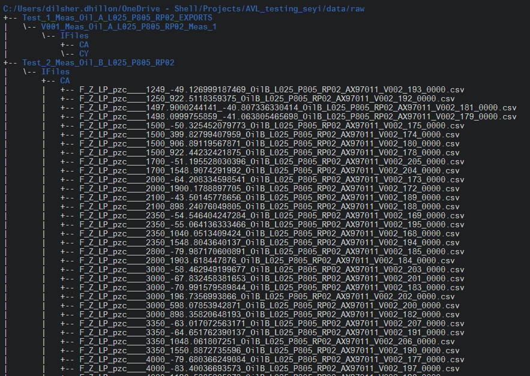

# Regex_metadata

The goal of Regex_metadata is to demonstrate how to use regex in conjunction with {stringr}, {data.table} and {tidyverse} libraries to extract meta deta from filenames, into a variable along with the data contained in the file.  

# Files  
The notebook `Data_aggregation_summary.Rmd` under the notebook folder takes in as example two file names(from the 320 csv files of the engine test), and demonstrates how to extract the needed information from the file names, and finally merge all of them into one data structure in R(simply describes the function that would be used, the actual merging isn't done in this document).      

 

# Knitting Document   
Follow the `Data_aggregation_summary.Rmd` to test out the Regex or view the `Data_aggregration_summary.Pdf` to view both the code chunks and analysis   